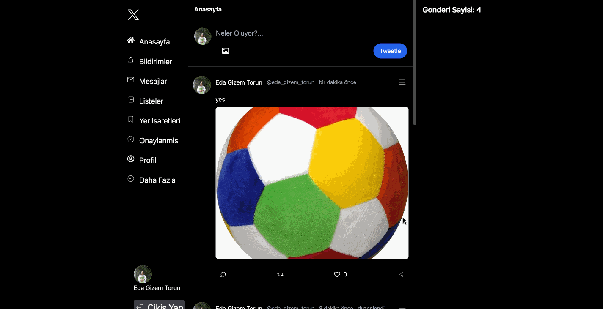

<h1>X-Clone</h1>

# LIBRARY

- react-router-dom
- tailwind
- react-icons
- react-toastify
- moment
- uuid
- firebase

# Authentication (Kimlik dogrulama)

- Bir kullanicinin kimligini dogrulama surecidir.
- Kullanici adi ve sifre, parmak izi, yuz tanima, google hesabi kullanilarak kullanicinin kimligi dogrulanabilir.

# Authhorization (Yetkilendirme)

- Bir kullanicinin sistemin kaynaklarina, islevlerine, sayfalarina erisme izni verme veya reddetme surecidir.
- Yani kimlik dogrulama basarili olduktan sonra kullanicinin ne kadar erisime sahip oldugunu belirleme surecidir.

<h1>Screenshot</h1>

